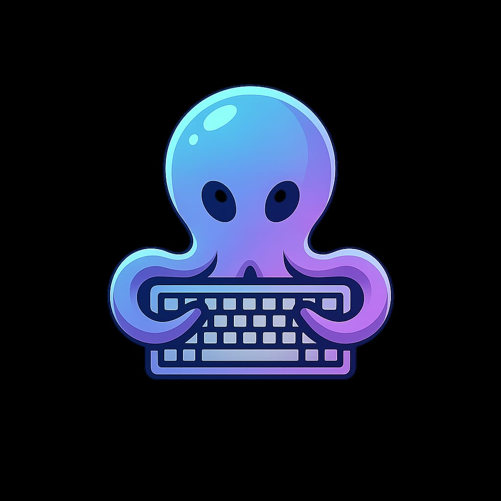
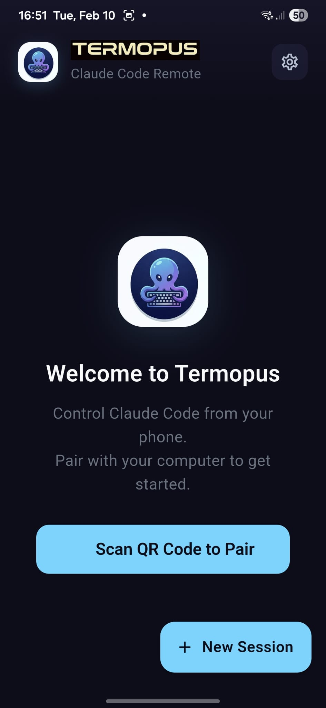
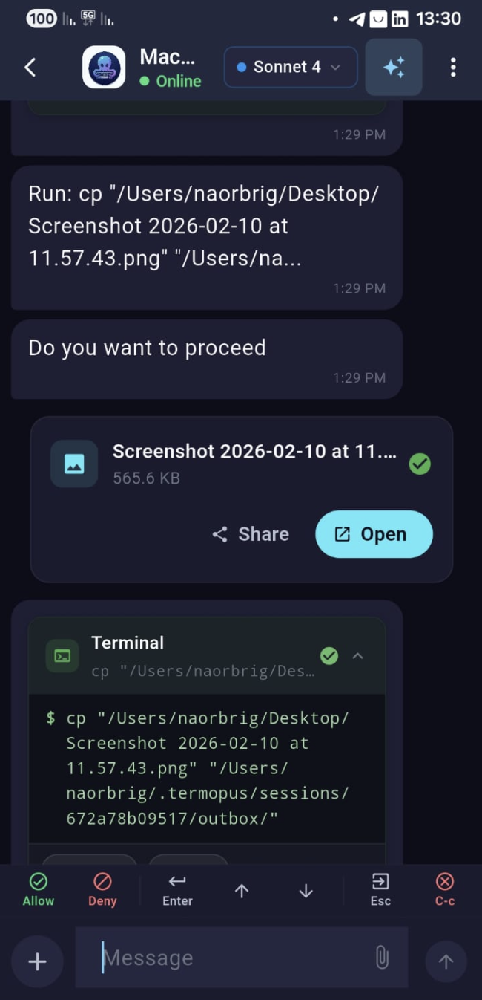

<p align="center">
  
</p>

<h1 align="center">Termopus</h1>

<p align="center">
  <strong>Control Claude Code from your phone — E2E encrypted, self-hosted, open source</strong>
</p>

<p align="center">
  <a href="LICENSE"></a>
  <a href="https://github.com/Termopus/termopus/stargazers"></a>
  <a href="https://github.com/Termopus/termopus/issues"></a>
  <a href="https://github.com/Termopus/termopus/pulls"></a>
</p>

<p align="center">
  
  
  
  
  
  
  
  
</p>

<br />

<p align="center">
  
  &nbsp;&nbsp;&nbsp;&nbsp;&nbsp;&nbsp;&nbsp;&nbsp;&nbsp;&nbsp;
  
</p>

<p align="center">
  
  &nbsp;&nbsp;&nbsp;&nbsp;&nbsp;&nbsp;&nbsp;&nbsp;&nbsp;&nbsp;
  
</p>

<br />

---

## What is Termopus?

Termopus is an open-source mobile remote for [Claude Code](https://docs.anthropic.com/en/docs/claude-code). Approve file edits, review diffs, and chat with Claude — all from your phone. Everything is end-to-end encrypted, self-hosted on your own Cloudflare account, and secured with mutual TLS.

## Why?

Claude Code stops and waits every time it needs permission to edit a file or run a command. If you step away from your desk, work stops too. Termopus lets you approve, deny, or respond from your phone — so Claude keeps working while you're on the couch, in a meeting, or grabbing coffee.

You can also resume any Claude Code session across all your projects, start new ones, and even preview what Claude builds through localhost — all from your phone.

## Features

- **Chat interface** — WhatsApp-style conversation showing Claude's output in real time
- **One-tap approvals** — Allow / Deny / Edit buttons for file changes
- **Code diffs** — Syntax-highlighted previews of proposed edits
- **Push notifications** — Get notified when Claude is waiting (optional, requires Firebase)
- **Multi-session** — Control multiple Claude Code instances from one phone
- **E2E encrypted** — AES-256-GCM encryption with hardware-backed keys
- **Self-hosted** — Runs entirely on your own Cloudflare account

## Architecture

```
COMPUTER                     CLOUDFLARE                      PHONE
────────                     ──────────                      ─────
Claude Code                                               Flutter App
    ↓                                                         ↓
Bridge (Rust)  ←── WebSocket ──→  Relay DO  ←── WebSocket ──→  Native WS
    ↓                            (opaque)                       ↓
Encrypt(msg)                                             Decrypt(msg)
```

The **bridge** runs alongside Claude Code on your computer. It connects to a **Cloudflare Durable Object** relay via WebSocket. Your phone connects to the same relay. All messages are **end-to-end encrypted** — the relay only forwards opaque blobs.

| Component | Tech | Description |
|-----------|------|-------------|
| **Phone App** | Flutter (iOS / Android) | Chat UI, biometric auth, hardware-backed keys |
| **Bridge** | Rust (macOS / Linux) | Runs alongside Claude Code, encrypts all traffic |
| **Relay** | Cloudflare Durable Objects | Stateful WebSocket relay, opaque message forwarding |
| **Provisioning API** | Cloudflare Workers | Device certificate issuance, challenge-response auth |

## Quick Start

### Prerequisites

| Tool | Version | Install |
|------|---------|---------|
| Cloudflare account | Free tier | [Sign up](https://dash.cloudflare.com/sign-up) |
| Node.js | 18+ | [nodejs.org](https://nodejs.org/) |
| Flutter | 3.11+ | [flutter.dev](https://docs.flutter.dev/get-started/install) |
| Rust | Latest stable | [rustup.rs](https://rustup.rs/) |
| wrangler | Latest | `npm install -g wrangler` |
| OpenSSL | Any | Pre-installed on macOS/Linux |

### 1. Deploy Backend

```bash
git clone https://github.com/Termopus/termopus.git
cd termopus

wrangler login
./scripts/setup.sh
```

The setup script will:
1. Create KV namespaces (`FCM_TOKENS`, `PROVISIONED_DEVICES`, `SUBSCRIPTIONS`)
2. Update worker configs with namespace IDs
3. Install dependencies and deploy both Cloudflare Workers
4. Generate a CA certificate for mTLS device authentication
5. Set CA secrets on both workers
6. Print your relay and provisioning API URLs

### 2. Build the App

```bash
# Connect your phone via USB, then:
cd app
flutter pub get
flutter run
```

### 3. Run the Bridge

```bash
cd bridge
cargo build --release
./target/release/termopus --relay wss://YOUR_RELAY_WORKER_URL
```

> Replace `YOUR_RELAY_WORKER_URL` with the URL printed by setup.sh

### 4. Pair

Scan the QR code displayed by the bridge with the Termopus app on your phone. That's it.

## Configuration

### Placeholders

After running `setup.sh`, most configuration is automatic. If you need to configure manually:

| Placeholder | File | Description |
|---|---|---|
| `YOUR_FCM_TOKENS_KV_ID` | `*/wrangler.toml` | KV namespace ID for FCM tokens |
| `YOUR_PROVISIONED_DEVICES_KV_ID` | `*/wrangler.toml` | KV namespace ID for device certificates |
| `YOUR_SUBSCRIPTIONS_KV_ID` | `*/wrangler.toml` | KV namespace ID for subscriptions |
| `YOUR_PROVISIONING_API_URL` | `app/lib/shared/constants.dart` | Deployed provisioning worker URL |
| `YOUR_RELAY_URL` | `bridge/src/main.rs` | Deployed relay worker URL (`wss://`) |

### Custom Domains (Optional)

| Placeholder | File | Description |
|---|---|---|
| `YOUR_RELAY_DOMAIN` | `relay_worker/wrangler.toml` | Custom domain for relay |
| `YOUR_API_DOMAIN` | `provisioning_api/wrangler.toml` | Custom domain for API |

### Push Notifications (Optional)

The app ships with a placeholder `google-services.json` that allows building without Firebase. To enable push notifications:

1. Create a Firebase project at [console.firebase.google.com](https://console.firebase.google.com)
2. Replace `app/android/app/google-services.json` with your config
3. For iOS: add `GoogleService-Info.plist` to `app/ios/Runner/`
4. Set FCM secrets on the relay worker:
   ```bash
   cd relay_worker
   wrangler secret put FCM_PROJECT_ID --env dev
   wrangler secret put FCM_SERVICE_ACCOUNT_EMAIL --env dev
   wrangler secret put FCM_SERVICE_ACCOUNT_KEY --env dev
   ```

## Security

Termopus uses a **7-layer security model**. Every connection is end-to-end encrypted and authenticated with mutual TLS.

| Layer | Protection | Always On | Description |
|:-----:|------------|:---------:|-------------|
| 1 | **Hardware-backed keys** | Yes | Secure Enclave (iOS) / StrongBox (Android) |
| 2 | **Session binding** | Yes | Sessions locked to hardware device ID |
| 3 | **E2E encryption** | Yes | AES-256-GCM with ephemeral ECDH key exchange |
| 4 | **Cloudflare Tunnel** | Optional | Zero-trust network access, no open ports |
| 5 | **mTLS certificates** | Yes | Mutual TLS client certificate authentication |
| 6 | **Device attestation** | Optional | App Attest (iOS) / Play Integrity (Android) |
| 7 | **Biometric gate** | Yes | Face ID / Fingerprint required to open the app |

> See [docs/MTLS.md](./docs/MTLS.md) for details on the mTLS implementation.

## Project Structure

```
termopus/
├── app/                    # Flutter mobile app (iOS / Android)
│   ├── lib/                # Dart source code
│   ├── android/            # Android-specific (Kotlin bridge, signing)
│   └── ios/                # iOS-specific (Swift bridge, entitlements)
├── bridge/                 # Rust desktop bridge agent
│   └── src/                # Relay connection, encryption, QR pairing
├── relay_worker/           # Cloudflare Worker — WebSocket relay
│   └── src/                # Durable Object, auth, push notifications
├── provisioning_api/       # Cloudflare Worker — device provisioning
│   └── src/                # CSR signing, challenge-response, KV storage
├── scripts/
│   ├── setup.sh            # One-command setup (includes mTLS)
│   └── setup-mtls.sh       # Standalone mTLS re-setup
├── assets/                 # Logo, icons, screenshots
└── docs/                   # Documentation
```

## Roadmap

- **Windows support** — Bridge for Windows is in development. Stay tuned.

## Contributing

Contributions are welcome! Here's how to get started:

1. **Open an [issue](https://github.com/Termopus/termopus/issues)** to discuss your idea or report a bug
2. **Fork** the repo and create a feature branch
3. **Submit a pull request** with a clear description of changes

Please make sure your code follows the existing patterns in the codebase.

## License

This project is licensed under the [AGPL-3.0 License](LICENSE).

---

<p align="center">
  Built with <a href="https://flutter.dev">Flutter</a>, <a href="https://www.rust-lang.org">Rust</a>, and <a href="https://developers.cloudflare.com/workers/">Cloudflare Workers</a>
</p>
